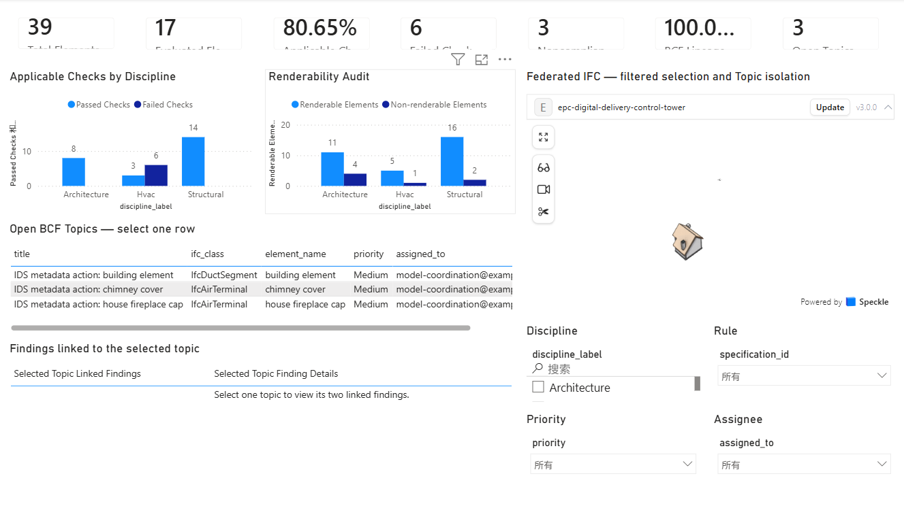

# EPC Digital Delivery Control Tower

**From BIM Model Data to Delivery Decisions**

[](https://github.com/EricRoosevelt/epc-digital-delivery-control-tower/actions/workflows/ci.yml)

This portfolio prototype converts multidisciplinary IFC model data and
project-authored information requirements into traceable digital-delivery
findings and future management KPIs.

It uses public buildingSMART sample models and clearly identifies
project-specific assumptions. It is not presented as a production deployment.



## V1.0.0 at a Glance

The verified portfolio fixture contains three multidisciplinary IFC models and
39 federated element occurrences. The end-to-end workflow produces:

| Delivery measure | Verified result |
| --- | ---: |
| Source IFC models | 3 |
| Federated element occurrences | 39 |
| Evaluated elements | 17 |
| Applicable IDS checks | 31 |
| Passed / failed checks | 25 / 6 |
| Selected-rule applicable pass rate | 80.65% |
| Noncompliant elements | 3 |
| Deterministic BCF 3.0 topics | 3 |
| Failed-check-to-BCF lineage | 6/6 (100%) |

The 80.65 percent result is an **applicable-check pass rate for the selected
project-authored rules**, not an overall model-compliance score. The six
failed checks belong to three elements and generate three traceable BCF topics.

## Current MVP

The current implementation:

- parses Architecture, Structural, and HVAC IFC models;
- registers source-model identity and content hashes;
- extracts a 39-element federated model inventory;
- generates a project-authored IDS;
- validates all three IFC models in one batch;
- produces JSON, HTML, and normalized CSV validation results;
- converts the six failed checks into three deterministic BCF 3.0 issues;
- validates BCF XML, archive safety, model lineage, and repeatability;
- delivers a de-identified Power BI Project with seven KPI cards, four
  operational filters, BCF finding lineage, and Speckle 3D topic isolation.

## Data Pipeline

```text
Public IFC models
-> Python and IfcOpenShell
-> models.csv and model_inventory.csv
-> project-authored IDS requirements
-> IfcTester validation
-> per-model JSON and HTML reports
-> normalized ids_findings.csv
-> deterministic BCF 3.0 issues and analytical sidecars
-> Power BI semantic model and KPI measures
-> Speckle federated-model selection and topic isolation
```

## Data Products

### `data/processed/models.csv`

One row represents one source IFC model.

It records:

* stable `model_id`;
* source filename and discipline;
* IFC project GUID and schema;
* source-file SHA-256;
* source URL and license.

### `data/processed/model_inventory.csv`

One row represents one `IfcElement` occurrence in one source model.

| Field          | Description                                          |
| -------------- | ---------------------------------------------------- |
| `model_id`     | Stable source-model identifier                       |
| `source_model` | Source IFC filename                                  |
| `discipline`   | Model discipline                                     |
| `element_key`  | Federated unique key: stable model ID plus IFC GlobalId |
| `global_id`    | IFC GlobalId within the source model                 |
| `ifc_class`    | IFC entity class, such as `IfcWall` or `IfcBeam`     |
| `name`         | Element name                                         |
| `storey`       | Related `IfcBuildingStorey`, when available          |
| `pset_count`   | Number of property sets associated with the element  |

A bare IFC `GlobalId` is not treated as unique across federated discipline
files. Cross-model joins use:

```text
element_key = model_id::global_id
```

The fixture contains 39 unique `element_key` values but only 32 distinct bare
IFC GlobalIds because four GUID groups recur across discipline files. A bare
GlobalId is therefore never used as a federated join key.

### `data/processed/ids_findings.csv`

One row represents one normalized IDS requirement result for one applicable
element, or one `N/A` result when no elements are applicable.

The current batch produces 47 findings with the normalized statuses:

* `PASS`;
* `FAIL`;
* `N/A`.

Every non-`N/A` finding can be traced back to a `model_id` and `element_key`.
Stable requirement and finding UUIDv5 keys are generated once in Python for
downstream lineage; dashboard queries do not reimplement identity logic.

The complete table definitions and constraints are documented in
[`docs/data_contract.md`](docs/data_contract.md).

## IDS Validation Rules

The project-authored IDS is:

```text
ids/epc_delivery_requirements_v0.1.ids
```

Version 0.1 contains five business rule groups implemented as seven IDS
specifications:

| Rule       | Requirement                                                                      |
| ---------- | -------------------------------------------------------------------------------- |
| `R-001`    | `IfcWall` must provide `Name`                                                    |
| `R-002`    | `IfcWall` must provide `Pset_WallCommon.IsExternal`                              |
| `R-003`    | `IfcBeam` must provide `Pset_BeamCommon.LoadBearing`                             |
| `R-004A/B` | `IfcDuctSegment` and `IfcAirTerminal` must have an applicable spatial assignment |
| `R-005A/B` | Selected HVAC elements must provide the assumed EPC `AssetTag` and `SystemCode` metadata |

R-005 is a project-specific assumed EPC delivery requirement. Its failure does
not mean the public buildingSMART sample model is defective.

Further rule definitions and interpretation are documented in
[`ids/README.md`](ids/README.md).

## Current Validation Results

| Rule group                        | Architecture | Structural |     HVAC |
| --------------------------------- | -----------: | ---------: | -------: |
| Wall Name                         |     PASS 4/4 |   PASS 4/4 |      N/A |
| Wall IsExternal                   |     PASS 4/4 |   PASS 4/4 |      N/A |
| Beam LoadBearing                  |          N/A |   PASS 6/6 |      N/A |
| Duct spatial assignment           |          N/A |        N/A | PASS 1/1 |
| Air-terminal spatial assignment   |          N/A |        N/A | PASS 2/2 |
| Assumed duct EPC metadata         |          N/A |        N/A | FAIL 0/1 |
| Assumed air-terminal EPC metadata |          N/A |        N/A | FAIL 0/2 |

In `ids_findings.csv`, the six failed requirement checks are reported as
`WARNING` because they belong to the project-specific R-005 assumption. This
severity is assigned by the project's normalization logic, not by the native
IfcTester report.

A zero-applicable result is normalized to `N/A`; it is not counted as 100
percent compliance.

`ids_findings.csv` is the canonical normalized source for Control Tower KPIs.
The raw IfcTester JSON and HTML reports retain IfcTester's native aggregates,
where an optional zero-applicable specification may appear as passed even
though its individual section is marked as skipped. Those native headline
percentages must not be used as the dashboard compliance measure.

## Power BI and Speckle Control Tower

The tracked Power BI Project is under [`dashboard/`](dashboard/). Its semantic
model uses normalized repository data for KPIs and the official Speckle visual
for federated 3D selection. The accepted single-page report provides:

- seven formula-driven KPI cards;
- applicable-check and renderability views by discipline;
- Discipline, Rule, Priority, and Assignee filters;
- three BCF topics with two linked findings each;
- selection of exactly one issue element in the federated 3D view.

The Direct IFC connector mapping uniquely resolves all 39 inventory
`element_key` values. Of those, 32 elements have IFC representations and all
32 map to renderable objects. Seven `Representation=NULL` elements remain in
the semantic inventory and are reported separately; they are not claimed as
highlightable geometry. All three issue elements are mapped, renderable, and
verified in the topic workflow.

The committed PBIP/PBIR/TMDL source and de-identified evidence are public and
reproducible. Real Speckle model/version URLs, authentication state, cached
connector data, and the connected PBIX remain local and Git-ignored. Opening a
fully connected copy therefore requires Power BI Desktop, the official Speckle
connector/visual, and user-controlled access to the source models. See
[`dashboard/README.md`](dashboard/README.md) for the exact boundary and
reconnection procedure.

## Reports

The batch validation generates one JSON report and one HTML report for each
source model:

```text
reports/ids/architecture.json
reports/ids/architecture.html
reports/ids/structural.json
reports/ids/structural.html
reports/ids/hvac.json
reports/ids/hvac.html
```

JSON reports provide detailed machine-readable validation output. HTML reports
provide human-readable review output.

### BCF issue workflow

The current six `FAIL` findings form three element-level issues. Each issue has
exactly two linked findings, one perspective viewpoint, and one selected HVAC
IFC component. The issue wording records that a project-assumed information
requirement is unmet; it does not classify the public sample as defective.

Generated artifacts are:

```text
reports/bcf/ids_failures.bcf
reports/bcf/run_manifest.json
data/processed/bcf_topics.csv
data/processed/bcf_topic_findings.csv
data/processed/bcf_viewpoints.csv
data/processed/bcf_viewpoint_components.csv
data/processed/bcf_topic_events.csv
```

The normative generator and validator use the official pinned BCF 3.0 XSDs
and do not import `bcf-client`. See
[`docs/bcf_data_contract.md`](docs/bcf_data_contract.md) for identities,
sidecar grains, archive rules, and validation gates.

## Run Locally

Create and activate a Python virtual environment:

```powershell
py -m venv .venv
.\.venv\Scripts\Activate.ps1
```

Install the dependencies:

```powershell
python -m pip install -r requirements.txt
```

Generate the model register and inventory:

```powershell
python src\extract_inventory.py
```

Generate the project IDS:

```powershell
python src\generate_ids.py
```

Validate all three IFC models and generate the reports and normalized findings:

```powershell
python src\validate_ids.py
```

Generate and strictly validate the deterministic BCF workflow:

```powershell
python src\generate_bcf.py
python src\validate_bcf.py
```

Install development dependencies and run the regression suite:

```powershell
python -m pip install -r requirements-dev.txt
python -m pytest -p no:cacheprovider tests -q
```

Validate the repository-safe dashboard data and tracked Power BI Project:

```powershell
python src\validate_dashboard.py --mode core
python src\validate_pbip.py
python -m pip check
```

## Reproducibility and Input Protection

* Files in `data/raw` are read-only source inputs.
* The validation script checks each IFC file against its recorded SHA-256.
* The validation `run_id` is derived from the IDS and source-model hashes.
* Repeated validation with unchanged inputs produces the same ordered
  `ids_findings.csv`.
* The verified normalized findings SHA-256 is:

```text
ea7d2fa2cd1690eb8b791dcab2792f116238566f0c60b10b64f1b02ce504eb4d
```

* The deterministic BCF SHA-256 is:

```text
b3c6f51abc9647ef4baeee9f9bccd884094b362362e516778c4bf083326abc99
```

## Data Source and Attribution

The IFC sample models are taken from the buildingSMART International
[Sample-Test-Files repository](https://github.com/buildingSMART/Sample-Test-Files),
specifically the
[IFC 4 PCERT Sample Scene](https://github.com/buildingSMART/Sample-Test-Files/tree/main/IFC%204.0.2.1%20%28IFC%204%29/PCERT-Sample-Scene).

Files used:

* `Building-Architecture.ifc`
* `Building-Structural.ifc`
* `Building-Hvac.ifc`

A second project uses three further unmodified samples from the same
repository, the
[IFC 4 ISO Spec Reference View 1.2 set](https://github.com/buildingSMART/Sample-Test-Files/tree/cecf656112a54a0d8cdd8b06b9398bfea5163886/IFC%204.0.2.1%20%28IFC%204%29/ISO%20Spec%20-%20ReferenceView_V1.2),
pinned at commit `cecf656112a54a0d8cdd8b06b9398bfea5163886`:

* `wall-with-opening-and-window.ifc`
* `column-straight-rectangle-tessellation.ifc`
* `basin-tessellation.ifc`

Copyright buildingSMART International Ltd.

The sample files are licensed under the
[Creative Commons Attribution 4.0 International License](https://creativecommons.org/licenses/by/4.0/).

The IDS rules and normalization logic are authored for this portfolio
prototype and are not official buildingSMART delivery requirements.

## Current Limitations

* The inventory is a selected `IfcElement` export, not a complete IFC database export.
* Geometry, materials, quantities, connections, and individual property values are not fully extracted.
* The first IDS version covers selected information requirements, not all BIM quality dimensions.
* Property actual values are left blank when IfcTester does not provide them consistently; the pipeline does not invent data.
* The validation results demonstrate a portfolio workflow, not a contractual model acceptance decision.
* The BCF workflow covers IDS failures only; it is not an issue-server sync.
* The Power BI evidence is a validated portfolio fixture, not a hosted
  production monitoring service.
* Revit may be used for optional downstream visual or BCF review, but it is not
  an ingestion, validation, or control-tower source of truth.
* A fully connected local Power BI/Speckle copy requires the private,
  explicitly confirmed model-version URLs described under `dashboard/`; those
  URLs and credentials are intentionally not distributed.
