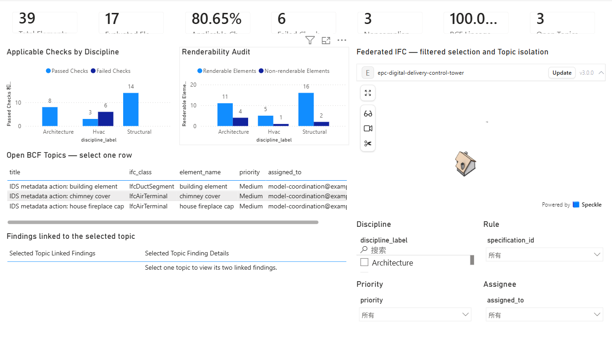

# EPC Digital Delivery Control Tower

**BIM Doctor** is a personal open-source project about the check before an IFC
model is handed from one discipline to the next, and the recheck after it. Its
preview demonstrates, on a simulated example, what a BIM manager would see: which
elements are still open, what to do, who does it, what a recheck must show, and
what changed after a recheck. On your own IFC4 file it runs one rule only (see
below).

[](https://github.com/EricRoosevelt/epc-digital-delivery-control-tower/actions/workflows/ci.yml)

**[Start with the example · 先体验示例](#quick-start)** · [中文快速开始](#中文快速开始) ·
[Check your own IFC4 file](#check-your-own-ifc4-file-limited) ·
[What is real, what is simulated](#what-is-real-and-what-is-simulated) ·
[For engineers](#for-engineers-the-framework)

It runs on your own machine and listens on `127.0.0.1` only. It is a preview, not a
release and not a production deployment. It uses public buildingSMART sample models
(CC BY 4.0; see [Data Source and Attribution](#data-source-and-attribution)).

## Two things you can try

| | **Start with the example** | **Check your own IFC4 file** |
| --- | --- | --- |
| What it is | A simulated handover: a first check with 13 items (8 to handle), then a recheck in which one conclusion changes although neither model was reissued. | A real run of one rule on a file you choose: each air terminal must declare one of four predefined types (rule PV-001). |
| What you see | For an item: the element, what to do, who handles it, what a recheck must show. | For each air terminal: pass or fail, with the element's name, IFC Tag and GlobalId. |
| Limits | The team arrangement and the human determinations are the example's own settings, marked on the page. | IFC4 only. One rule. Not a general quality check, and it does not give the handover conclusions the example shows. A Revit file itself cannot be imported. |

## Quick start

Needed before you install anything:

* **Python 3.11 or newer** (`pyproject.toml`). The commands below were run with
  Python 3.14.7 on Windows 11 in PowerShell, from a fresh clone and a new virtual
  environment. They have not been run on macOS or Linux; the same steps should work
  with `python3 -m venv .venv` and `.venv/bin/python` in place of the Windows
  paths. CI runs the test suite on Linux and Windows.
* **Git**, or download the repository as a ZIP file.
* **A web browser**, and internet access for the one-time install: about 80 MB is
  downloaded (IfcOpenShell, IfcTester, pandas and their dependencies) and the
  virtual environment takes about 280 MB. Installing took about a minute here.

```powershell
git clone https://github.com/EricRoosevelt/epc-digital-delivery-control-tower.git
cd epc-digital-delivery-control-tower
py -m venv .venv
.\.venv\Scripts\python.exe -m pip install -r requirements.txt
.\.venv\Scripts\python.exe doctor/serve.py
```

The server prints its address and the folder where local checks are kept. Open
**<http://127.0.0.1:8765/>**. The interface opens in Chinese. **Stop the server with
Ctrl+C** in the terminal. If the port is taken, add `--port 8770` (any free port) to
the last command. The server changes no file that Git tracks.

### What you will see

1. On the home page, click **选择模拟示例** (choose a simulated example), the card
   marked as the recommended start.
2. In the catalogue, under **第一步** (step one), click **打开这个示例的结果**
   (open this example's result): the first-check result, 13 items, 8 to handle.
3. On any card, click **查看这一项** (see this item). The item page gives the
   conclusion, what to do, the handling team, and what a recheck must show; the
   element's identity and exactly what is missing follow.
4. Lower on the item page, click **在示例“模型未改，但交接判断发生变化”里看这一项**
   (see this item in the example "models unchanged, but the handover judgement
   changed"): the recheck of the same record. Neither model is republished. The item
   you came from stays blocked; one other item (*building element*) moves from
   **受阻** (blocked) to **可以开始** (can start). The page says that a check
   requirement it was judged against changed, and does not say whether it was
   relaxed or tightened.

The same example is also in the catalogue as **第二步** (step two).

## Check your own IFC4 file (limited)

This is a product validation exercise, not a quality check of your model. It
applies one rule, PV-001: every air terminal (`IfcAirTerminal`) must declare one of
the predefined types `DIFFUSER`, `GRILLE`, `LOUVRE` or `REGISTER`. A fail does
not mean your project has a defect, and a pass does not say the classification is
right or that any work can start. It gives none of the handover conclusions the
example shows.

1. On the home page click **开始本地检查** (start a local check). Before you choose
   anything, the page says what is checked, where the requirement comes from, how to
   read a result, and what this computer keeps.
2. Choose one or more `.ifc` files (IFC4 text files only: the page says it does not
   accept `.ifczip`, `.ifcxml` or Revit files, and an IFC2x3 file is refused with how
   to export it again), declare each file's discipline, click **查看检查范围** (view
   the scope), then **运行检查** (run the check).
3. The result opens on its own page.

To try it without a model of your own, use a public sample from the clone:
`data/raw/Building-Hvac.ifc`, declared as HVAC. It runs in about a second and gives
2 results, both fails. `data/raw/Building-Architecture.ifc`, declared as
Architecture, has no air terminals; the page says "nothing applicable" and says that
is not a pass.

Your files are copied to a folder on your own machine and nothing is uploaded. The
server prints the folder when it starts; it is never inside the checkout. To choose
it yourself, start the server with
`.\.venv\Scripts\python.exe doctor/serve.py --checks-dir "<a folder you choose>"`.
The page explains how to clean the records up. More in
[`doctor/README.md`](doctor/README.md#a-fourth-entry-a-local-check-of-your-own-ifc).

## What is real and what is simulated

* **The example is a simulation of a handover.** The team arrangement, the accepted
  evidence methods and the human determinations (for example "does the opening pass
  through the receiving model's element") are the example's own settings, marked
  where they appear. It cannot be used for a project decision and offers no export.
  In the first-check example the check results beside them come from a real run of
  the shipped rules; elsewhere a conclusion can also rest on a simulated check
  result, and each conclusion says which kind it cites.
* **Your own file gets a real run**, of one rule only (see above).
* **Not built:** importing a Revit file itself, an overall compliance or "can be
  delivered" conclusion, writing back to a model, uploading, opening an element in
  Revit, starting a recheck from the page, marking an item resolved, and assigning or
  notifying anyone.
* **Status of the wording.** The interface opens in Chinese, and an English wording
  is available (`?lang=en` on any address). The wording of the main path, in both
  languages, has been through this project's own domain-wording review; the
  corrections that review asked for are still being applied. So this is a preview,
  not a reviewed release. The record, activity and member pages are not translated
  and say so.

## 中文快速开始

BIM Doctor 是个人开源项目，讲的是 IFC 模型从一个专业交给下一个专业之前的检查，以及
之后的复检。本机预览只监听 `127.0.0.1`，不是正式发布，也不是生产部署，界面默认是中文。
它用一个模拟示例演示 BIM 经理会看到什么：哪些构件还没处理、要做什么、由谁处理、复检要
拿什么证明，复检之后什么变了。对你自己的 IFC4 文件，目前只做一条规则（见下面第 7 条）。

1. 需要：Python 3.11 或更新；Git（或下载 ZIP）；浏览器；首次安装要联网，下载约 80 MB，
   虚拟环境约占 280 MB。下面的命令在 Windows 11 的 PowerShell、Python 3.14.7 下，从全新
   克隆和新建的虚拟环境实测过；macOS 和 Linux 没有实测。
2. 安装并启动：

   ```powershell
   git clone https://github.com/EricRoosevelt/epc-digital-delivery-control-tower.git
   cd epc-digital-delivery-control-tower
   py -m venv .venv
   .\.venv\Scripts\python.exe -m pip install -r requirements.txt
   .\.venv\Scripts\python.exe doctor/serve.py
   ```

3. 浏览器打开 <http://127.0.0.1:8765/>。端口被占用时，在最后一条命令后加
   `--port 8770`。在终端里按 Ctrl+C 停止。
4. 点 **选择模拟示例**；在 **第一步** 下点 **打开这个示例的结果**：共 13 个事项，其中
   8 个需要处理。
5. 在任一卡片上点 **查看这一项**，看结论、要做什么、处理团队、完成后拿什么复检。
6. 想看复检之后的变化：在单项页下方点
   **在示例“模型未改，但交接判断发生变化”里看这一项**；也可以回到示例目录，打开
   **第二步**。
7. 检查自己的模型：首页点 **开始本地检查**。只接受 IFC4 文件，只做 PV-001 一条规则
   （风口须声明四种预定义类型之一），不是通用质量检查，也不给示例里的交接结论；Revit
   文件本身不能导入。可以先用克隆里的公开样例 `data/raw/Building-Hvac.ifc`（专业选暖通）试。
   文件只复制到本机，不上传；记录所在的文件夹在服务器启动时会打印出来。

读结果时记住三点，页面上都有对应的说明：事项数不是缺陷数；“无法判断”不等于这个构件
没有问题；处理团队是示例里的安排，不代表已经派发。主路径的中英措辞经过本项目自己的领域
措辞复核，复核提出的修正还在落实，所以这仍是预览，不是已复核的发布版；记录、活动、成员
等明细页没有翻译。英文界面在任一地址后加 `?lang=en` 即可。

## For engineers: the framework

Underneath BIM Doctor is `epc-ct`, a deterministic validation framework. It checks
IFC models against project-authored requirements (IDS, plus a cross-model
completeness check) and writes findings, issues and a BCF 3.0 archive. CI
regenerates every published artifact on Linux and Windows and fails if one byte
moves. In the same environment as above, each of these ran in a few seconds:

```powershell
.\.venv\Scripts\python.exe -m epc_control_tower.cli check      # validate, write nothing
.\.venv\Scripts\python.exe -m epc_control_tower.cli run        # write every enabled exporter's artifacts
.\.venv\Scripts\python.exe -m epc_control_tower.cli snapshot   # does the published contract still match?
```

After `run` the checkout is unchanged (the output is byte-identical), apart from an
internal coverage record kept in your user state folder. To build on it, start at
[`AGENTS.md`](AGENTS.md#where-to-extend): three extension points (`Checker`,
`GroupingPolicy`, `Exporter`), a rule is one TOML file under `rules/<ruleset>/`, and
a project is a directory under `projects/`. The published contract is described in
[`docs/data_contract.md`](docs/data_contract.md) and [`CHANGELOG.md`](CHANGELOG.md).

## Reference

Everything below is longer reference: what is built and what is not, the two data
layers, the frozen Power BI / Speckle showcase and its numbers, the data contract,
the Purpose design, and limitations. Each number belongs to the layer its section
names.

## What works today

Four groups, so that a simulation is never read as a result and a built part is
never read as an accepted one.

**1. Implemented, and runs today on the public samples**

* `epc-ct run` validates the sample projects' IFC models (IDS validation and a
  cross-model completeness check) and writes findings, issues and a BCF 3.0
  archive: data contract 1.7, rule set 2.2, with the counts under
  [Canonical pipeline at a glance](#canonical-pipeline-at-a-glance-contract-17).
  CI regenerates every published artifact on Linux and Windows and fails if one
  byte moves.
* The Purpose Pack and Project Overlay loader, an assessment evaluator and a
  `recheck` that succeeds a sealed record
  ([below](#purpose-packs-and-project-overlays)). A library: there is no
  `epc-ct` command for it.
* The BIM Doctor preview ([Quick start](#quick-start)): a local server and screens
  for the first check, one item and a recheck, and the limited check of your own
  IFC4 file, in Chinese and English (status of the wording: see
  [What is real and what is simulated](#what-is-real-and-what-is-simulated)).
* The frozen Power BI / Speckle showcase (below, under *Other entry points*; it is separate from BIM Doctor).

**2. Shown only in simulation**

* The handover assessment in Doctor. The team arrangement, the accepted evidence
  methods and the human determinations (for example "does the opening pass
  through the receiving model's element") are the example's own settings, marked
  where they appear. The example cannot be used for a project decision and offers
  no export. In the first-check example the check results beside them come from a
  real run of the shipped rules; elsewhere a conclusion can also rest on a
  simulated check result, and each conclusion says which kind it cites.
* The recheck screens, shown on simulated scenarios built for the preview.
* The bundled sample project's own attempt, which Doctor's second entry shows
  being refused. That is the correct result, not a fault: the sample has never
  staffed a team or accepted an evidence method, so every assessment it could make
  would rest on a demonstration row (see the Purpose section below).

**3. A controlled real case, awaiting acceptance**

* Doctor's workspace entry, `python doctor/serve.py --workspace <dir> [--prior <dir>]`,
  shows the result of a real `epc-ct run` held in a workspace outside the
  checkout, and compares it with an earlier run. It shows check results and
  where to find each element in the authoring tool. It makes no handover
  assessment, names no team and never says anything was fixed. It is built on the
  isolated `product-validation` rule set 1.0 ([`rules/product-validation/`](rules/product-validation/README.md)),
  and the interface is described in [`doctor/README.md`](doctor/README.md). Its
  screens are in Chinese and English (status of the wording: see
  [What is real and what is simulated](#what-is-real-and-what-is-simulated)).
  It has been exercised privately on one real IFC model under controlled
  conditions; that model is not in this repository. It has had one round of
  BIM-domain review. It is not yet accepted as a product feature: a
  walk-through of the real path by a person acting as manager, and product
  acceptance itself, are still to come.

**4. Not built**

* Importing a Revit file itself (`.rvt`), and checking your own model against
  anything but the one product validation exercise
  ([the local check](doctor/README.md#a-fourth-entry-a-local-check-of-your-own-ifc)).
* An overall compliance, constructability or "can be delivered" conclusion.
* Writing back to the model, uploading, and opening an element in Revit.
* Starting a recheck, marking an item resolved, assigning or notifying anyone,
  and exporting a recheck record.
* Accepting a risk, and continuing or ending a release.
* Attributing a change to a fix made in Revit or Tekla.
* A Singapore research view.

The first three of these are the limits Doctor's own home screen states; the
others are listed in [`doctor/README.md`](doctor/README.md) and in
[Not implemented](#not-implemented).

## Other entry points

* **Build on the framework.** Start at
  [`AGENTS.md`](AGENTS.md#where-to-extend): three extension points (`Checker`,
  `GroupingPolicy`, `Exporter`), a rule is one TOML file under `rules/<ruleset>/`,
  and a project is a directory under `projects/`. Run it with
  `python -m epc_control_tower.cli run`. The published contract is described in
  [`docs/data_contract.md`](docs/data_contract.md) and [`CHANGELOG.md`](CHANGELOG.md).
* **The frozen Power BI / Speckle showcase.** One project at one moment, V1.0.0,
  pinned byte for byte by test. Open the tracked Power BI Project under
  [`dashboard/`](dashboard/README.md); its acceptance evidence is in
  [`docs/evidence/stage_3b/`](docs/evidence/stage_3b/README.md). A fully connected
  copy needs Power BI Desktop and the official Speckle connector; see
  [Power BI and Speckle Control Tower](#power-bi-and-speckle-control-tower).



## Two layers, and which numbers belong to which

This repository holds two things at once, and almost every number below belongs
to exactly one of them. Reading a figure from one layer as if it described the
other is the single easiest mistake to make here.

| | **Canonical pipeline** | **Frozen V1.0.0 showcase** |
| --- | --- | --- |
| What it is | The live framework: `epc-ct run`, every stage and exporter | A pinned demonstration of one project at one moment |
| Version | **Framework / data contract 1.7**, rule set 2.2 | V1.0.0, IDS v0.1, 47 findings |
| Scope | Both projects in `projects/` | One project, one frozen rule set version |
| Where it lands | `data/processed/canonical/`, `reports/bcf/issues.bcf` | The eight legacy CSVs, `reports/bcf/ids_failures.bcf`, the PBIP dashboard |
| Moves when | The pipeline or the rules change | **Never** — it is byte-pinned by test |

The Power BI / Speckle dashboard and its evidence screenshots read the **frozen
showcase**, not the canonical layer. That is why the dashboard still shows three
models and 47 findings while the canonical pipeline covers six and 121: the two
`Legacy…` exporters reproduce a frozen identity derivation on purpose, and they
retire together in Phase 5. See `AGENTS.md` for why that scope exists.

## Canonical pipeline at a glance (contract 1.7)

What one `epc-ct run` currently produces across every project in `projects/`:

| Canonical measure | Current result |
| --- | ---: |
| Projects | 2 |
| Source IFC models | **6** |
| Federated elements | **44** |
| Findings | **121** |
| Issues | **21** |
| Requirements | 14 |
| Project milestones | 6 |

These are the counts the framework stands behind today. They are produced by
the canonical stages and written to `data/processed/canonical/`; the general
`BcfExporter` projects the whole run into `reports/bcf/issues.bcf`.

## V1.0.0 showcase at a glance (frozen)

Everything in this section describes the **frozen** fixture and does not move.
The verified portfolio fixture contains three multidisciplinary IFC models and
39 federated element occurrences. The end-to-end workflow produces:

| Delivery measure | Verified result |
| --- | ---: |
| Source IFC models | 3 |
| Federated element occurrences | 39 |
| Evaluated elements | 17 |
| Applicable IDS checks | 31 |
| Passed / failed checks | 25 / 6 |
| Selected-rule applicable pass rate | 80.65% |
| Noncompliant elements | 3 |
| Deterministic BCF 3.0 topics | 3 |
| Failed-check-to-BCF lineage | 6/6 (100%) |

The 80.65 percent result is an **applicable-check pass rate for the selected
project-authored rules**, not an overall model-compliance score. The six
failed checks belong to three elements and generate three traceable BCF topics.

## What the frozen showcase demonstrates

The workflow behind the V1.0.0 figures above:

- parses Architecture, Structural, and HVAC IFC models;
- registers source-model identity and content hashes;
- extracts a 39-element federated model inventory;
- generates a project-authored IDS;
- validates all three IFC models in one batch;
- produces JSON, HTML, and normalized CSV validation results;
- converts the six failed checks into three deterministic BCF 3.0 issues;
- validates BCF XML, archive safety, model lineage, and repeatability;
- delivers a de-identified Power BI Project with seven KPI cards, four
  operational filters, BCF finding lineage, and Speckle 3D topic isolation.

## Data Pipeline

```text
Public IFC models
-> Python and IfcOpenShell
-> models.csv and model_inventory.csv
-> project-authored IDS requirements
-> IfcTester validation
-> per-model JSON and HTML reports
-> normalized ids_findings.csv
-> deterministic BCF 3.0 issues and analytical sidecars
-> Power BI semantic model and KPI measures
-> Speckle federated-model selection and topic isolation
```

## Data Products

### `data/processed/models.csv`

One row represents one source IFC model.

It records:

* stable `model_id`;
* source filename and discipline;
* IFC project GUID and schema;
* source-file SHA-256;
* source URL and license.

### `data/processed/model_inventory.csv`

One row represents one `IfcElement` occurrence in one source model.

| Field          | Description                                          |
| -------------- | ---------------------------------------------------- |
| `model_id`     | Stable source-model identifier                       |
| `source_model` | Source IFC filename                                  |
| `discipline`   | Model discipline                                     |
| `element_key`  | Federated unique key: stable model ID plus IFC GlobalId |
| `global_id`    | IFC GlobalId within the source model                 |
| `ifc_class`    | IFC entity class, such as `IfcWall` or `IfcBeam`     |
| `name`         | Element name                                         |
| `storey`       | Related `IfcBuildingStorey`, when available          |
| `pset_count`   | Number of property sets associated with the element  |

A bare IFC `GlobalId` is not treated as unique across federated discipline
files. Cross-model joins use:

```text
element_key = model_id::global_id
```

The fixture contains 39 unique `element_key` values but only 32 distinct bare
IFC GlobalIds because four GUID groups recur across discipline files. A bare
GlobalId is therefore never used as a federated join key.

### `data/processed/ids_findings.csv`

One row represents one normalized IDS requirement result for one applicable
element, or one `N/A` result when no elements are applicable.

This is a frozen legacy projection, not the canonical findings table; the
canonical one is `data/processed/canonical/findings.csv`, which currently holds
121 rows across both projects. The frozen batch produces 47 findings with the
normalized statuses:

* `PASS`;
* `FAIL`;
* `N/A`.

Every non-`N/A` finding can be traced back to a `model_id` and `element_key`.
Stable requirement and finding UUIDv5 keys are generated once in Python for
downstream lineage; dashboard queries do not reimplement identity logic.

The complete table definitions and constraints are documented in
[`docs/data_contract.md`](docs/data_contract.md).

## IDS Validation Rules

The project-authored IDS is:

```text
ids/epc_delivery_requirements_v0.1.ids
```

Version 0.1 contains five business rule groups implemented as seven IDS
specifications:

| Rule       | Requirement                                                                      |
| ---------- | -------------------------------------------------------------------------------- |
| `R-001`    | `IfcWall` must provide `Name`                                                    |
| `R-002`    | `IfcWall` must provide `Pset_WallCommon.IsExternal`                              |
| `R-003`    | `IfcBeam` must provide `Pset_BeamCommon.LoadBearing`                             |
| `R-004A/B` | `IfcDuctSegment` and `IfcAirTerminal` must have an applicable spatial assignment |
| `R-005A/B` | Selected HVAC elements must provide the assumed EPC `AssetTag` and `SystemCode` metadata |

R-005 is a project-specific assumed EPC delivery requirement. Its failure does
not mean the public buildingSMART sample model is defective.

Further rule definitions and interpretation are documented in
[`ids/README.md`](ids/README.md).

## Current Validation Results

| Rule group                        | Architecture | Structural |     HVAC |
| --------------------------------- | -----------: | ---------: | -------: |
| Wall Name                         |     PASS 4/4 |   PASS 4/4 |      N/A |
| Wall IsExternal                   |     PASS 4/4 |   PASS 4/4 |      N/A |
| Beam LoadBearing                  |          N/A |   PASS 6/6 |      N/A |
| Duct spatial assignment           |          N/A |        N/A | PASS 1/1 |
| Air-terminal spatial assignment   |          N/A |        N/A | PASS 2/2 |
| Assumed duct EPC metadata         |          N/A |        N/A | FAIL 0/1 |
| Assumed air-terminal EPC metadata |          N/A |        N/A | FAIL 0/2 |

In `ids_findings.csv`, the six failed requirement checks are reported as
`WARNING` because they belong to the project-specific R-005 assumption. This
severity is assigned by the project's normalization logic, not by the native
IfcTester report.

A zero-applicable result is normalized to `N/A`; it is not counted as 100
percent compliance.

`ids_findings.csv` is **not** the canonical source of truth. It is one of the
frozen legacy projections: a normalized view of one project under one pinned
rule set version, kept byte-stable so the published dashboard and its evidence
keep meaning what they meant. The canonical record for the whole run is
`data/processed/canonical/` — `findings.csv` and `issues.csv` in particular —
and any new consumer should read that instead. `ids_findings.csv` remains
authoritative for the V1.0.0 dashboard KPIs and for nothing else, and it
retires with the other `Legacy…` outputs in Phase 5.

The raw IfcTester JSON and HTML reports retain IfcTester's native aggregates,
where an optional zero-applicable specification may appear as passed even
though its individual section is marked as skipped. Those native headline
percentages must not be used as the dashboard compliance measure.

## Power BI and Speckle Control Tower

The tracked Power BI Project is under [`dashboard/`](dashboard/). Its semantic
model uses normalized repository data for KPIs and the official Speckle visual
for federated 3D selection. The accepted single-page report provides:

- seven formula-driven KPI cards;
- applicable-check and renderability views by discipline;
- Discipline, Rule, Priority, and Assignee filters;
- three BCF topics with two linked findings each;
- selection of exactly one issue element in the federated 3D view.

The Direct IFC connector mapping uniquely resolves all 39 inventory
`element_key` values. Of those, 32 elements have IFC representations and all
32 map to renderable objects. Seven `Representation=NULL` elements remain in
the semantic inventory and are reported separately; they are not claimed as
highlightable geometry. All three issue elements are mapped, renderable, and
verified in the topic workflow.

The committed PBIP/PBIR/TMDL source and de-identified evidence are public and
reproducible. Real Speckle model/version URLs, authentication state, cached
connector data, and the connected PBIX remain local and Git-ignored. Opening a
fully connected copy therefore requires Power BI Desktop, the official Speckle
connector/visual, and user-controlled access to the source models. See
[`dashboard/README.md`](dashboard/README.md) for the exact boundary and
reconnection procedure.

## Reports

The batch validation generates one JSON report and one HTML report for each
source model:

```text
reports/ids/architecture.json
reports/ids/architecture.html
reports/ids/structural.json
reports/ids/structural.html
reports/ids/hvac.json
reports/ids/hvac.html
```

JSON reports provide detailed machine-readable validation output. HTML reports
provide human-readable review output.

### BCF issue workflow

The current six `FAIL` findings form three element-level issues. Each issue has
exactly two linked findings, one perspective viewpoint, and one selected HVAC
IFC component. The issue wording records that a project-assumed information
requirement is unmet; it does not classify the public sample as defective.

Generated artifacts are:

```text
reports/bcf/ids_failures.bcf
reports/bcf/run_manifest.json
data/processed/bcf_topics.csv
data/processed/bcf_topic_findings.csv
data/processed/bcf_viewpoints.csv
data/processed/bcf_viewpoint_components.csv
data/processed/bcf_topic_events.csv
```

The normative generator and validator use the official pinned BCF 3.0 XSDs
and do not import `bcf-client`. See
[`docs/bcf_data_contract.md`](docs/bcf_data_contract.md) for identities,
sidecar grains, archive rules, and validation gates.

## Run Locally

Create and activate a Python virtual environment:

```powershell
py -m venv .venv
.\.venv\Scripts\Activate.ps1
```

Install the dependencies:

```powershell
python -m pip install -r requirements.txt
```

### BIM Doctor preview

```powershell
python doctor\serve.py
```

Then open <http://127.0.0.1:8765/>. The walk-through is under
[Quick start](#quick-start). To look at the result of a real `epc-ct run` held in a
workspace outside this checkout, add `--workspace <dir>` and, to compare it with an
earlier run, `--prior <dir>`; both are described in
[`doctor/README.md`](doctor/README.md).

### Canonical pipeline

```powershell
python -m epc_control_tower.cli check
python -m epc_control_tower.cli run
python -m epc_control_tower.cli snapshot
```

`check` validates without writing anything, `run` writes every enabled
exporter's artifacts, and `snapshot` compares the published contract with its
record. `epc-ct` is the same command once the package is installed; without
installing it, `python -m epc_control_tower.cli` does the same, as `AGENTS.md`
describes.

### Frozen showcase

The frozen V1.0.0 artifacts (the eight legacy CSVs and
`reports/bcf/ids_failures.bcf`) are written by the same `run`, through the two
`Legacy…` exporters; CI fails if a run changes any of their bytes. To validate
the frozen BCF archive strictly on its own:

```powershell
python src\validate_bcf.py
```

### Tests and gates

Install development dependencies and run the regression suite:

```powershell
python -m pip install -r requirements-dev.txt
python -m pytest -p no:cacheprovider tests -q
```

One test, the IDS syntax audit, needs a tool the suite does not install and
skips with instructions without it; `AGENTS.md` lists the full gate order CI
runs.

Validate the repository-safe dashboard data and tracked Power BI Project:

```powershell
python src\validate_dashboard.py --mode core
python src\validate_pbip.py
python -m pip check
```

## Reproducibility and Input Protection

* Files in `data/raw` are read-only source inputs.
* The validation script checks each IFC file against its recorded SHA-256.
* The validation `run_id` is derived from the IDS and source-model hashes.
* Repeated validation with unchanged inputs produces the same ordered
  `ids_findings.csv`.
* The verified normalized findings SHA-256 is:

```text
ea7d2fa2cd1690eb8b791dcab2792f116238566f0c60b10b64f1b02ce504eb4d
```

* The deterministic BCF SHA-256 is:

```text
b3c6f51abc9647ef4baeee9f9bccd884094b362362e516778c4bf083326abc99
```

## Data Source and Attribution

The IFC sample models are taken from the buildingSMART International
[Sample-Test-Files repository](https://github.com/buildingSMART/Sample-Test-Files),
specifically the
[IFC 4 PCERT Sample Scene](https://github.com/buildingSMART/Sample-Test-Files/tree/main/IFC%204.0.2.1%20%28IFC%204%29/PCERT-Sample-Scene).

Files used:

* `Building-Architecture.ifc`
* `Building-Structural.ifc`
* `Building-Hvac.ifc`

A second project uses three further unmodified samples from the same
repository, the
[IFC 4 ISO Spec Reference View 1.2 set](https://github.com/buildingSMART/Sample-Test-Files/tree/cecf656112a54a0d8cdd8b06b9398bfea5163886/IFC%204.0.2.1%20%28IFC%204%29/ISO%20Spec%20-%20ReferenceView_V1.2),
pinned at commit `cecf656112a54a0d8cdd8b06b9398bfea5163886`:

* `wall-with-opening-and-window.ifc`
* `column-straight-rectangle-tessellation.ifc`
* `basin-tessellation.ifc`

Copyright buildingSMART International Ltd.

The sample files are licensed under the
[Creative Commons Attribution 4.0 International License](https://creativecommons.org/licenses/by/4.0/).

The IDS rules and normalization logic are authored for this portfolio
prototype and are not official buildingSMART delivery requirements.

## Purpose Packs and Project Overlays

A **Purpose Pack** states a reusable question: which production activities a
handover is deciding about, what evidence each needs, and how those evidence
outcomes would reach a verdict. It names no project. A **Project Overlay** is
one project's policy against the Pack(s) it uses — which of that project's
validation rules answer a project-specific question, which methods it accepts,
how a role is staffed, and who may authorise a release. Neither holds an answer.

Both exist as files and both are read:

```text
purpose-packs/interdisciplinary-coordination-readiness/pack.toml
projects/pcert-sample/project.toml        # its [overlay] table
```

`epc_control_tower/purpose/` loads them and composes them for a project, or
refuses. Refusing is the whole behaviour on any defect: every version, binding,
reference and role must resolve, and the eighteen structural invariants a
decision tree must satisfy are checked at load time, before any project uses the
file. There is no partial load and no reduced-capability mode. Each refusal
carries a code naming the rule it enforces, so the mapping between the design
and the loader is a test rather than a claim.

What the composition produces is validated *configuration*. It contains no
verdict, no evidence outcome, no reading, no assigned team, and no risk
acceptance — not as a field, not as a cached value. A `default_role` in it is
still not an assignment: composition checks that the Overlay's `team_mapping`
*has* a row for it, and stops there, because an assignment is a decision made
against particular model versions and a configuration object has none.

### Running one

`epc_control_tower/purpose/assessment/` is the demand-driven operation that
turns those inputs into an answer. Given a project, a Pack, some activities, an
explicitly declared assessed scope and a model-version context, it either
refuses or returns one sealed **assessment record**, in which every subscope
carries the whole chain: the evidence read, the verdict, the `resolution_kind`,
the route that kind resolves through — consequence kinds, default role, next
action, recheck condition — and the team this project staffs that role with.

A few properties are worth stating because they are what the design is for:

* **A scope whose evidence disagrees is partitioned, not reduced.** There is no
  activity-level verdict. Under a scope of the whole `hvac` model, the schedules
  activity splits into three elements that fail R-005 and reach `BLOCKED`, and a
  zero-finding `IfcChimney` that reaches `UNKNOWN` — two subscopes, two
  verdicts, held apart.
* **Scope is declared, never discovered.** It never comes from which elements
  happen to carry a finding. An activity admits subjects from that scope by its
  declared `subject_classes` and by nothing else, so the `IfcChimney` is in for
  what it *is*, and the two `IfcBuildingElementProxy` setout markers are out for
  the same kind of reason — all three have zero findings.
* **Absence is never success.** A rule that applied to nothing reads as
  not-covered, not as a pass. Severity does not soften a verdict: R-005A and
  R-005B fail at `WARNING` and reach `BLOCKED`.
* **It moves no published byte.** The record lives outside `data/processed/`,
  `reports/`, `ids/` and the contract snapshot, is read back by nothing, and
  the one identifier it mints is never an input to any published value.

A sealed record can be **succeeded, never amended**. A `recheck` re-derives the
whole assessment from current evidence and returns a *new* sealed record saying,
for each subscope it answers for, three things that are not the same thing: where
that subscope's members are now, which of its evidence citations still carry, and
what could be established about its recheck condition — usually nothing, because
most of those conditions are sentences written for people and nothing here
adjudicates prose. A member that has vanished is classified — deleted from the
re-issued model, out of the activity's subject classes, a pair the current
determination no longer names, or a key this request's scope no longer declares —
and none of the four is read as resolved.

**Two things a production owner meets first, and neither is a fault.**

* **After a model re-issue, activities go back to `UNKNOWN`.** A determination is
  admissible only for the model versions it names, so a coordination review held
  against last week's export says nothing about this week's. The openings
  activity retreats from a `READY` pair and a `BLOCKED` pair to a single
  `UNKNOWN`, and the ceiling activity's alignment retreats to `not-yet-confirmed`.
  Nothing broke: the evidence behind the old verdicts was about models that no
  longer exist. What a recheck adds is the *reason* — that the citations stopped
  being attributable — rather than a bare `UNKNOWN`.
* **The sample in this repository produces no record, and that is permanent.**
  See below; it is a standing property, not an outstanding task.

**And one thing a production owner never meets, which is exactly why it is
written here.** Both notices above are things you run into. This one you cannot
run into, because what it is about is not in the record at all: **nobody in this
design is designated to declare the assessed scope, and an element nobody
declared is absent from every part of the answer.** Scope being declared rather
than discovered is the right decision and the reason the `IfcChimney` surfaces —
but it is declared by a person, and the accounting that says nothing disappears
is an accounting *of the declared keys*. A key that was never declared is not an
admitted subject, is not listed as out of class, and leaves no trace of the
place where it would have been. There is no check for this and there should not
be: nothing here has a concept of a scope being "too narrow", and no evidence
inside an assessment could tell the handover apart from what somebody
remembered.

The uncomfortable part is that a narrow scope reads *better*. Declare the whole
`hvac` model and the schedules activity answers `BLOCKED` over three elements
and `UNKNOWN` over a chimney no rule reached; declare just those three elements
and the same activity answers `BLOCKED` over three, with nothing `UNKNOWN` and
nothing reported out of class — every word of it true, and it looks like the
complete answer. A project adopting this design has to name who declares the
scope, and that person answers for declaring it narrowly. See
[`0003`](docs/decisions/0003-runtime-purpose-assessment-shape.md) §10.2 item 8.

**`pcert-sample` cannot produce one, that is the correct result, and it is a
standing property rather than a gap.** Every live verdict across its three
activities is non-`READY`, every non-`READY` subscope needs a resolving
assignment, and all four of its `team_mapping` rows are `illustrative` — so every
assignment it could make would rest on a demonstration row. The assessment
refuses, and names the four rows and the routes each one would have had to found.
Its three `accepted_evidence_methods` rows are `illustrative` too, so a
determination produced by one of those methods is refused on the same principle
from the other direction. This project has never appointed a team and has never
accepted an evidence method; nothing in this repository has been staffed, and no
record here claims otherwise. Making the sample produce a record would mean
writing `project-decision` onto nine rows describing decisions nobody took, which
is exactly what that field exists to prevent. Every positive path in the design is
covered instead on an isolated test fixture, through the same entry point and with
no test flag, no skip switch, and no relaxed check.

**Nothing in the pipeline reads either file.** `epc-ct run`, `check`, `group`
and every exporter are unaffected by their presence, their contents, or their
absence; the loader is not a `Checker`, a `GroupingPolicy` or an `Exporter`, and
appears in no registry. That is measured rather than assumed: the test suite
runs the whole pipeline twice into the same destination — editing a Pack,
editing an Overlay, adding a Pack no project references, and giving a second
project an Overlay — and diffs every output byte.

**The worked Overlay's policy rows are illustrative, and say so.** Every row of
`pcert-sample`'s `team_mapping`, `risk_authorisations` and
`accepted_evidence_methods` carries `decision_basis = "illustrative"`: this
repository has never recorded a real staffing decision, risk-authorisation
policy, or accepted evidence method, and none of those nine rows should be read
as one. The field is required, has no default, and a row without it is refused —
so a demonstration value cannot quietly pass for a decision. The evidence
bindings and the convention note carry no such field and need none; they state
which of this repository's real rules answer a question, which is a fact rather
than a policy.

The shapes both files take, and why, are fixed in
[`docs/decisions/0002-minimal-purpose-pack-project-overlay.md`](docs/decisions/0002-minimal-purpose-pack-project-overlay.md).
The runtime shape an assessment takes is fixed in
[`docs/decisions/0003-runtime-purpose-assessment-shape.md`](docs/decisions/0003-runtime-purpose-assessment-shape.md),
of which the evaluator and the `recheck` above are the implementation so far —
request scope, subscopes, the record, the identity boundary, and succeeding a
sealed record. What those two documents design and this implementation does not
build is listed below.

## Not implemented

Named here because they are discussed around this project and are easy to assume
exist. Treat each as named-but-unbuilt, and do not infer a design from the name.

The Purpose inputs, an evaluator over them, and a `recheck` that succeeds a
sealed record are built. What a *release* needs after that — accepting a risk,
carrying it forward, ending it — is not, and neither is anything that stores,
publishes, or acts on a record. That is the boundary this section is about.

* **Continuing or ending a release** — there is no `CONDITIONAL` promotion, and
  no `authorisation` successor record. A sealed record can be succeeded by a
  `recheck`, and that half is built and described above; what is missing is
  everything about accepting a risk. A release granted over a known deficiency
  has nowhere in this repository to be recorded at all, so there is nothing to
  carry forward and nothing to lapse. `authorisation` is named in the successor
  vocabulary so that the missing second kind is a designed gap on the record
  rather than one nobody thought of, and nothing sits behind the name. That
  naming is a statement of design and not a check: the field is an unvalidated
  string, and nothing in the code enforces the vocabulary. A second Pack, a Pack
  registry, and any Overlay override mechanism are likewise absent, as is any
  published machine contract or `epc-ct` command for an assessment. The only
  experience of one is the internal [BIM Doctor preview](doctor/README.md): it is
  not a release, it shows an example whose policy and determinations are
  simulated, and its attempt at the sample project's own assessment is refused
  (see above). Where a record is stored is also still an open decision: both
  entry points return one and write no file, and nothing stores a determination
  either — those are read by reference, from somebody else's store, and this
  repository has none.
* **Readiness from validation metadata** — a readiness verdict exists now, but
  only as a function of *(evidence outcome, decision tree)* and only inside an
  assessment record. It is never derived from validation metadata, and the
  distinction is load bearing rather than pedantic: `Finding.is_issue` and the
  `Issue` record are *validation* concepts — `is_issue` says a check failed in a
  way that warrants a topic, and an `Issue` groups such findings. Neither is a
  readiness verdict, the assessment cannot see either, and reading them as one
  will produce a number the pipeline never claimed.
* **Blockers outside an assessment** — `BLOCKED` is a verdict a subscope
  reaches, carrying a `resolution_kind` and the consequence *kinds* its Pack
  route names. Nothing else in this repository has a blocker concept, and the
  `Requirement` fields that look adjacent are not one: `owner_role`, `severity`,
  `stage`, `priority` and `labels` are *rule metadata* published in
  `requirements.csv`, carried for validation and for reproducing the frozen
  legacy archive. `priority` says when
  somebody will get to a failure, not what that failure stops; `owner_role` is
  the role the rule author expects to answer for the rule, not a final
  responsible-role decision; and severity does not soften a verdict. Nor does
  `discipline_scope` help: it says which disciplines a requirement is evaluated
  against, and carries no direction, so it cannot express an MEP-to-Architecture
  handoff — direction is Pack data. A consequence's *magnitude* is likewise
  absent: routes name kinds, the project's milestone dates are cited, and no
  duration, cost or delay is computed from either.
* **Source fix and recheck** — a `recheck` links a sealed assessment to a later
  validation run over the same members, and says of each one where it now stands.
  What nothing here can do is attribute any of that to a *fix*: no part of this
  repository observes a change made in Revit or Tekla, and the recheck is
  explicit that a member which has vanished is classified rather than read as
  resolved. So the loop from a fix made at source to the validation that confirms
  it is still missing its first half. What should close it is an open question,
  not a settled one: recomputing only the changed objects is one possible answer,
  but it is not the assumed design and nothing here presumes it. For the
  avoidance of doubt about present behaviour, `epc-ct run` recomputes the full
  scope every time.

Separately from any of that, eight things this design **cannot** do — and which
a project adopting it therefore has to give to a person — are recorded together
in [`docs/decisions/0003-runtime-purpose-assessment-shape.md`](docs/decisions/0003-runtime-purpose-assessment-shape.md)
§10.2, with the two that follow from the Pack/Overlay data shape in
[`docs/decisions/0002-minimal-purpose-pack-project-overlay.md`](docs/decisions/0002-minimal-purpose-pack-project-overlay.md)
§9. Two of them are the notices above, on that list because a production owner
runs into them without going looking, and one is the notice beside them that
nobody runs into — who declares the assessed scope, and what becomes of an
element nobody declared. The other five are about who is competent to determine
anything, what a `determiner` name does and does not prove, who owns the signal
that a cited determination was rewritten in place, why sealing a record does not
seal the documents it cites, and the fact that writing a record notifies nobody
and assigns nobody.

The three seams in `AGENTS.md` (`Checker`, `GroupingPolicy`, `Exporter`) are
extension points of the pipeline as it stands. They are not a roadmap, and none
of the above is a matter of implementing one of them — including the Purpose
loader above, which is deliberately none of the three and is registered
nowhere.

## Current Limitations

* The inventory is a selected `IfcElement` export, not a complete IFC database export.
* Geometry, materials, quantities, connections, and individual property values are not fully extracted.
* The first IDS version covers selected information requirements, not all BIM quality dimensions.
* Property actual values are left blank when IfcTester does not provide them consistently; the pipeline does not invent data.
* The validation results demonstrate a portfolio workflow, not a contractual model acceptance decision.
* The frozen BCF archive (`ids_failures.bcf`) covers the six IDS failures only.
  The canonical `issues.bcf` also carries failures from the cross-model
  completeness checker. Neither is an issue-server sync.
* The Power BI evidence is a validated portfolio fixture, not a hosted
  production monitoring service.
* Revit may be used for optional downstream visual or BCF review, but it is not
  an ingestion, validation, or control-tower source of truth.
* A fully connected local Power BI/Speckle copy requires the private,
  explicitly confirmed model-version URLs described under `dashboard/`; those
  URLs and credentials are intentionally not distributed.
