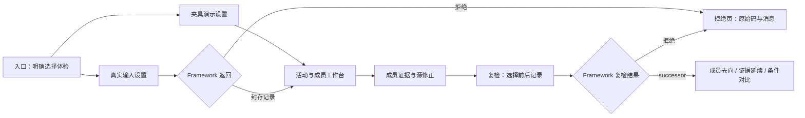

# D1 — BIM Doctor 最小屏幕流提案

状态：设计提案，等待 Tech / BIM / PM 三方评审；不是实现许可或验收结论。
对象：使用 Revit 的 BIM 分包经理。任务：说明指定模型交接前什么需要处理、
证据在哪里、回源如何修正，以及复检实际改变了什么。

## 1. 输入、依据与交付边界

- **PM 原始需求**：提交前检查 → 问题定位 → 源模型修正 → 复检；不用 JSON 或 CLI。
  原始 D1 位于本地提交 `bdd67b5719d1dd4f48af3af992ed0cb150035104` 的
  `docs/product/2026-09-16-dual-track-delivery-plan.md`。该提交是需求依据，
  不作为本 PR 的父提交，也不把其文件复制进本 PR。
- **Tech 任务包 / BIM 已裁定约束**：本轮用户提供的八条域约束；下文逐项落位。
  产品尚未裁定零 finding 的可区分性，不能用设计替产品作决定。
- **实现依据**：基线 `f06bab01939906d9231a56a7157de7136fe7b1ce`；
  [record.py](../../epc_control_tower/purpose/assessment/record.py)、
  [request.py](../../epc_control_tower/purpose/assessment/request.py)、
  [errors.py](../../epc_control_tower/purpose/errors.py)、
  [reading.py](../../epc_control_tower/purpose/assessment/reading.py)、
  [ADR 0003 §4.7](../decisions/0003-runtime-purpose-assessment-shape.md)、
  [现有 Pack](../../purpose-packs/interdisciplinary-coordination-readiness/pack.toml)。
  角色约定已读：AGENTS、Tech、PM、BIM、Product/UI 五份文件。
- 只增加本文；不写 UI、适配器、评估器，不改生产代码、规则、项目、Pack 或生成物。
  不承诺原生 RVT 接入、Revit 定位链接、写回、云上传、存储服务或公共 API。

## 2. 布局选择与屏幕流

推荐四屏：设置、成员工作台、证据详情、复检对比。工作台用活动导航与成员表，
详情为独立可返回页面；窄屏沿同一阅读顺序纵向排布。
相比全程向导，它支持经理在成员间反复核对；相比单页总览，它不把证据、
复检和设置挤在一起。此轮不做三维查看器，名称与可复制标识承担定位入口。



图中箭头是拟议交互，不表示今天已存在可调用 UI 接口。真实记录路径不能以
夹具替代；返回拒绝后仅允许修改输入重试或返回入口，进入演示必须重新显式选择。

### S0 / S1：体验入口与检查设置

入口用两个独立入口卡：“夹具演示 — 模拟政策与判定”“真实输入 — 保留真实拒绝”。
进入后每屏固定显示模式文字、项目与模型版本；演示页面持续显示“不能用于正式
项目决定，不提供真实评估记录导出”。切换模式清空当前选择与结果展示。

设置按经理的交接顺序排列：

1. 选择提交模型及接收模型的具体版本；名称旁显示内容标识，不能以文件名当版本。
2. 明确交出角色、接收角色、里程碑与声明日期。无真实交接资料时留空要求输入，
   不由规则 `owner_role` 或系统时钟填值；演示预置必须标注模拟。
3. 选择已支持的 Purpose Pack、版本、方向与活动，展示 Overlay 来源；
   “检查清单”在这里指所选 Pack 的活动/证据要求，不创造第二套规则清单。
4. 显式声明整模型或具体构件范围，展示声明摘要；范围从模型清单选择，
   绝不默认只选有 finding 的构件。Framework 负责展开和准入。

确认区重复“模型版本 × 交接 × Purpose/活动 × 声明范围”。修改设置后旧结果保持
其原上下文，只能标为“上次记录”，不能装成新请求的结果。必填缺失只阻止提交，
不生成 UNKNOWN。模型尚未接入则显示“输入不可用”，不是拒绝或成功。

**研究入口 Q**：单独的次级文本链接“新加坡候选清单（未实现）”，打开研究页。
该页不在 Framework 活动导航或结果表内，无裁决标签、运行按钮或执行统计；
研究 disposition 不能映射成 READY 等结果。候选来源、版本、适用性由 PM/BIM
提供；缺资料则标“尚未提供”。不表示新加坡完整覆盖、CORENET X 对齐或官方批准。

### SX：真实拒绝页

主标题：“评估被拒绝 — 本次没有生成评估记录”。展示所提交上下文、实际
`PurposeAssessmentError.code` 和完整消息。随附项目当前可见码为
`team-mapping-decision-basis-illustrative`。不显示零问题、完成百分比、成员裁决，
也不把异常变成 UNKNOWN。消息按文本显示，不执行或丢弃原文。

其下另设“当前版本的已知限制（说明，不是本次执行日志）”：

| 政策环节 | 此次真实运行与当前能力 |
| --- | --- |
| 团队映射 | 本次实际拒绝，以上方异常为准 |
| 证据方法 | 同一示例政策同样拒绝；须先越过前闸门且确实消费判定才会触发，不能标成已检查或通过 |
| 风险授权 | 同一政策在政策解析层同样拒绝；今天无运行时消费者，E2 尚未实现，不是可通过的下一步 |

固定文案：“处理当前拒绝原因不保证随后可评估；其余限制尚未由本次运行验证。”
这些是随附样例/基线的已知说明，不能泛化成其他项目的三项诊断结果。
没有多闸门诊断数据时不造进度条、不列三个运行异常，也不提供一键修复政策。

### S2：活动与成员工作台

```text
[夹具演示 / 真实输入]  项目 · 提交版本 → 接收版本 · 交接
Purpose / Pack版本 / 活动选择     声明范围摘要
活动导航 | 受评成员：成员名称或成员对 | Framework裁决 | 证据/缺口 | 查看
         | chimney + slab           | READY         | …         | → S3
         | chimney + roof           | BLOCKED       | …         | → S3
本活动排除范围（无裁决）：名称 | IFC类别 | out_of_subject_class
覆盖说明：记录中的缺口 / 未请求活动 / 无法区分的零finding来源
```

以上两行仅是**夹具场景**的版式示例，不能作为随附项目真实结果。默认成员粒度，
按记录活动与 subscope 顺序呈现。`members[].keys` 保留整对及顺序，
`refined_from` 显示“由烟囱细化”；同一构件可同时属于两个裁决。
subscope 的共用路径可在详情复用，不能把多个成员压成一个构件的最差或最佳裁决。
搜索烟囱应出现两行，标题/计数写“成员”，不写“问题构件数”。

排除范围紧接本活动结果并默认可见，不藏进高级筛选；两个 `IfcBuildingElementProxy`
设定点标记来自本活动 `out_of_subject_class`，展示名称、key 和类别，不带裁决、
修复角色或绿色标记。切换活动重新读取各自列表，不能合并成全局排除项。

工作台状态必须区分：

| 数据状态 | 可见表达 |
| --- | --- |
| 有成员记录 | 原样显示成员裁决；没有总体裁决、总准备度评分或“可交付”徽章 |
| `partition_is_empty` | “本活动无准入成员，因此无裁决”，同时显示排除范围 |
| 框架命名的证据缺口 | 显示原 `outcome` / `absence`、受影响成员与该记录的 UNKNOWN、行动和出口 |
| 零 finding 来源不明 | “当前数据无法区分：从未被规则评估 / 已评估但未被命名”；不选其中一种 |
| 活动未请求 | “本次未请求”，来自选择上下文，不叫 UNKNOWN、不虚构活动结果 |
| 名称关联缺失 | 保留完整 key 并显示“名称不可用”；不能丢行或借冻结清单补名 |
| 读取失败 / 尚无记录 | 明确错误或未运行状态，不显示空成功表格 |

“零 finding”不是“未受任何规则评估”的同义词。烟囱与 `geo-reference` 都无
finding 行；现有记录给出的 Purpose 缺口仍可显示，但不能据此推断规则评估历史。
**能区分这两类零 finding 的验收场景为阻塞中**，不画两个已可用的分类或筛选器。

### S3：成员证据、影响与源修正

页首固定活动、成员（包括整对）、模型版本与裁决；返回工作台保留选择和筛选。
正文顺序为“为什么 → 影响 → 谁应处理 → 回源做什么 → 复检需要什么”：

- 展示完整 `path`：证据要求、观察粒度、reading outcome、finding 引用、
  determination 引用及内容摘要标识，或命名的 absence。原始标识可展开复制；
  经理无需阅读 JSON。缺外部证据原件时明确“仅有引用，原件未提供”。
- R-010 放在独立“背景引用，不能回答对齐问题”区域，远离对齐 outcome。
  `context_citations` 完整逐字显示，不截去限定句；其中当前限定文本为：

  > R-010 witnesses a shared marker (name + cross-model GlobalId) only; a PASS is not alignment evidence and must never be read as satisfying this evidence requirement, in any of its three outcomes.

  对齐位置只呈现 Framework 的 reading；这段 PASS 不做对齐证据卡或绿色勾。
- 原样呈现 `resolution_kind`、`route.consequence_kinds`，里程碑仅作为引用，
  不计算工期/金额。UNKNOWN 的行动是补证据，不能改写成已知模型缺陷。
- 三行角色独立：**Pack 默认修复角色** `default_role`；
  **Overlay 记录的映射对象** `assigned_team_or_person` 与 `decision_basis`；
  **风险授权人：当前未实现（E2），没有授权记录**。第二行不提供“派发/已派活”
  动词，第三行不借用前两行或 determination 的签署者。READY 无 route/assignment
  时写“不适用（记录未携带）”，不猜负责人。
- `route.next_action` 与 `route.recheck_condition` 完整可读。源定位用 canonical
  名称、model_key、GlobalId、楼层及 element_key；回 Revit/持久建模工作流修正，
  不推荐临时 IFC 补丁。项目特定 Revit 字段和可靠源元素映射未提供时明说未提供，
  不展示假“在 Revit 打开”按钮。

### S4：复检对比

选择前后封存记录，仅呈现 Framework 给出的 `successor.kind = recheck` 比较；
没有 successor 就显示“尚无可用复检对比”，UI 不自行 diff 推出解除。
页首并排显示前后 producing/consuming 版本及记录引用；模型重发提示来自
`model_version_context_comparison`。正文三个并列区（窄屏顺序堆叠）：

1. **成员去了哪里**：从旧 subscope 逐一列出成员及 Framework 的去向、cause、
   当前 ordinals 和裁决。一个旧成员可链接多个当前成员，不能强配成一对一。
2. **旧证据是否仍被引用**：`evidence_carry_over` 的 reason、carried、引用及前后
   content digest。模型重发使旧判定无法归属当前上下文时显示原原因，
   不标为“证据不存在”或“原判定错误”；新记录的缺口与所需新证据另列。
3. **旧复检条件能证明什么**：逐字旧条件、`condition_status`、`condition_basis`、
   `correspondence` 与 `named_outcome`。与当前裁决隔开，不能用改善箭头替代。

| 成员去向（保留原码） | 给经理的含义 |
| --- | --- |
| `element-deleted-in-reissued-model` | 在重发模型中删除，不等于修复 |
| `element-out-of-subject-class` | 已不属于此活动对象类别，不等于修复 |
| `pairing-no-longer-derived` | 当前不再推导该成员对，不等于开洞已补 |
| `outside-declared-scope` | 本次未声明该范围，不等于问题解除 |
| `present` | 当前仍有对应成员；裁决与条件另看 |

五种条件状态逐一呈现：`named-outcome-observed`（仅命名结果已观察到）、
`named-outcome-not-observed`（未观察到）、`no-machine-checkable-part`
（没有可机检部分）、`not-comparable`（不可比较）、`no-recheck-condition`
（原记录没有复检条件）。**现有状态没有“整句条件已满足”**，不得新增此绿色状态。

必看反例：旧 `(chimney, roof)` 为 BLOCKED；新判定为不穿透，烟囱到达 READY。
原对为 `pairing-no-longer-derived`、原开洞条件为 `not-comparable`；不得说已建洞、
已添加交叉引用或“已解决”。另一个演示是模型重发后旧对齐判定不再可归属，
新记录出现 `not-yet-confirmed`：这是当前证据缺口，不是自动继承旧 READY。

## 3. 数据责任与缺口

UI 仅选择输入、关联名称、筛选/排版已有结果；所有准入、细化、裁决、去向、
证据延续、比较与条件状态由 Framework 产生。未知值显示不支持并保留原值，
不能兜底变成 READY、UNKNOWN 或空成功。

| 当前载体 | 使用位置 / 消费内容 |
| --- | --- |
| `AssessmentRecord.as_document().request` | S1/S2：Pack、方向、活动、明确范围、两个模型内容版本及 handover |
| `.provenance` | S3：validation run、规则集、composition、里程碑/成本参数名称，不估算幅度 |
| `.activities[]` | S2/S3：admitted subjects、empty、逐活动排除范围、subscopes 的 members/path/verdict/route/assignment |
| `.successor`（若有） | S4：旧记录引用、版本比较、成员去向、证据延续与条件比较 |
| `PurposeAssessmentError` | SX：code 和完整异常消息；Python 当前通过 `str(error)` 暴露文本，不假设有 `.message` 属性 |
| `data/processed/canonical/` | 以同一 validation run / 模型版本为前提，elements 的 key → name/class/storey/GlobalId，models 的模型名/内容哈希，findings/requirements 的引用明细 |

canonical `elements.csv` 本地计数 **44**（不含表头）。禁止连接
`data/processed/model_inventory.csv`；冻结展示轨的 39 行不能用来补齐当前裁决。
名称不参与身份判断；重发版本必须由 Framework 提供对应库存，不能把今天的
44 行清单当作任意版本的事实。模型级引用按 model_key 展示，不能捏造构件。

**需要 Framework 提供、而今天上述载体拿不到或未交付给 UI 的内容（逐项）**：

| 编号 | 数据需求与当前缺口 | 处理方式 / 决策归属 |
| --- | --- | --- |
| F1 | 可区分“从未被规则评估”和“已评估未被命名”的版本绑定覆盖证据；0 行 finding 不携带此信息 | 阻塞该验收；PM 裁定需求后 Tech 确定数据载体，UI 不推断 |
| F2 | 请求前的可选模型版本、Pack/活动 label、兼容性及 Overlay 标识/来源目录；封存 document 是请求后的记录，不是选择目录 | Framework 提供最小内部读取边界后才能连接 S1；不由 UI 重写兼容规则 |
| F3 | document 之外的 `AssessmentRecord.assessment_digest`、前后记录的获取方式，以及明确的真实/夹具来源标识 | digest 已存在于对象，但不在 `as_document()` 中；由 Framework 原样交付，UI 不重算封印、不猜模式；不要求新存储系统 |
| F4 | 多闸门完整诊断 / 执行到达信息 | 当前只有首个异常，SX 先用注明基线的已知限制说明；自动穷举诊断未承诺，不能由 UI 探测政策并造运行日志 |
| F5 | determination 原件与来源可读描述、与模型版本绑定的 Revit 源元素定位、项目具体修复字段/导出映射 | 当前只有引用/digest 与通用 next_action；原件、精确回源链接暂不可用。Framework 协调交付可信映射，UI 不伪造 |
| F6 | 原条件全文解除的证明，以及真实授权人/权限依据/授权事件 | 当前 condition_status 仅有有限证明，E2 无消费者；两者均不由 UI 补造。完整解除及授权体验不在本轮 |
| F7 | 真实新模型接入后的版本库存、验证事实及合法请求入口；夹具初始/复检记录及模拟来源说明 | Python 评估机制存在，不等于已接通 Doctor；由 Framework 后续内部适配提供。本轮不实现适配、也不要求用户上传 Revit 模型 |

新加坡候选来源与研究 disposition 由 PM/BIM 提供，不是要求 Framework 伪造
执行数据。F2–F5、F7 是集成需求清单，不构成本轮批准的新接口或公共契约。

## 4. 八条域约束与评审场景

| 约束 | 屏幕落位 | 评审时应能看到的区别 |
| --- | --- | --- |
| 1 零 finding | S2 覆盖说明、F1 | 显式无法区分；验收阻塞，不把两种来源假分组 |
| 2 成员粒度 | S2 成员对表、S3 页首、S4 多对应 | 同一烟囱的 slab/roof 对各有裁决 |
| 3 排除范围 | S2 每活动表后默认可见列表 | 两个设定点有名称/类别，没有裁决 |
| 4 拒绝 | SX | 一个实际异常，另两环节为已知限制；不承诺修好一个就可运行 |
| 5 R-010 | S3 独立背景引用区 | 限定句逐字保留，PASS 不占据对齐 outcome 位置 |
| 6 复检 | S4 三分区、四种离开去向 | 当前更好裁决与旧条件证明分开，无“已解决”折叠 |
| 7 三角色 | S3 三行角色区 | 默认角色、记录映射值、未实现授权人互不替代 |
| 8 新加坡 | S1 次级链接 → 独立 Q 研究页 | 明显“未实现”，无运行结果同级卡片 |

以下是提交给评审的走查脚本，**不是已执行验收或自评通过**：

| 场景 | 路径 / 预期边界 | 本轮状态 |
| --- | --- | --- |
| 从范围内结果找到证据与源修正 | S1 → S2 roof 成员 → S3，能复述版本、证据、影响、角色、next_action 和旧条件 | 设计待评审；精确 Revit 跳转受 F5 阻塞，通用指引可设计 |
| 找到零 finding 且仍需评价的成员，并区分两种来源 | S2 搜索烟囱和 geo-reference，不能把 0 行当规则覆盖证明 | **阻塞中：F1，等待产品裁定**；即使夹具也不假称满足 |
| 真实拒绝与空分区区别 | SX 的无记录拒绝，对照 S2 有记录但无准入成员/无裁决 | 设计待评审；实际可点击执行受 F7 阻塞 |
| 模型重发后证据缺口 | S4 展示版本变化、旧判定未延续原因，再到 S3 当前缺口与所需新证据 | 可用夹具机制的设计待评审；真实重发演示受 F7 阻塞 |
| 同构件两对不同裁决；两个设定点排除 | S2 同时看到 READY/BLOCKED 与不带裁决的排除表 | 夹具场景设计待评审，不冒充真实评估 |
| READY 不等于旧条件解除；四种离开去向 | S4 查看不再穿透反例及四种各自 reason | 设计待评审；“证明整句条件已解除”受 F6 阻塞，当前不作此承诺 |
| 真正授权或新加坡机器检查 | S3 未实现说明 / Q 研究页 | 未实现、非 D1 交付；不得计入已支持能力 |

阅读不依赖颜色：所有裁决、拒绝、排除与未实现均有文字；空值不以绿色短横线表达。
长引用保留全文并换行，key 可复制；表格有列名，焦点/返回位置可预测，键盘可进入
详情与返回。没有仅靠悬停才能看到的关键限定语。可用性与辅助技术测试需在后续
获批原型中执行；本轮没有目标用户验证，内部角色走查也不能代替它。

## 5. 停止点

本 PR 只请求对设计的审阅，不请求合并、实施或放宽政策。Tech 核数据来源与支持
边界，BIM 核成员/证据/修复/复检含义，PM 裁定 F1 与 D1 验收范围并审阅经理流程。
三方结论尚未收到；不得由本文宣告通过。后续 UI 与内部适配器需独立委派。

本地工程核验记录：仓库 `.venv` 的 ruff 无错误；强制
`EPC_REQUIRE_IDS_AUDIT=1` 的 pytest 为 830 passed、3773 subtests passed；
流水线复跑仍为 6 models / 44 elements / 121 findings / 21 issues；
`git diff --exit-code -- data/processed reports` 无差异，snapshot 报告 20 个
artifact 不变；dashboard core、PBIP 验证与 pip check 均完成，无依赖冲突。
这些仅证明工程边界未移动，不是界面验收。初始工作树实际有六份未跟踪用户文件
（五份 Agent 角色文件及 `Handoff-bim-domain-reviewer.md`），全部保留未跟踪未暂存。
